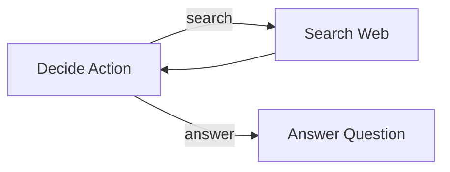

# PocketFlow Framework Guide for Claude Code

> **For AI Agents**: This document contains everything you need to build LLM applications using PocketFlow. Read carefully and follow the patterns described here.

## 📚 Table of Contents
1. [Quick Start](#quick-start)
2. [Core Concepts](#core-concepts)
3. [Node Types & Usage](#node-types--usage)
4. [Flow Patterns](#flow-patterns)
5. [Design Patterns](#design-patterns)
6. [Best Practices](#best-practices)
7. [Common Recipes](#common-recipes)
8. [Agentic Coding Workflow](#agentic-coding-workflow)

---

## Quick Start

### Installation
```bash
pip install pocketflow
```

### Minimal Example
```python
from pocketflow import Node, Flow

class GreetNode(Node):
    def prep(self, shared):
        return shared["name"]
    
    def exec(self, name):
        return f"Hello, {name}!"
    
    def post(self, shared, prep_res, exec_res):
        shared["greeting"] = exec_res

greet = GreetNode()
flow = Flow(start=greet)

shared = {"name": "World"}
flow.run(shared)
print(shared["greeting"])  # "Hello, World!"
```

---

## Core Concepts

### 1. The Node: Building Block of Everything

Every Node has **3 phases** (all optional):

```python
class MyNode(Node):
    def prep(self, shared):
        """Phase 1: READ data from shared store
        - Query databases
        - Read files
        - Serialize data into strings for LLM
        Returns: prep_res (passed to exec)
        """
        return shared["input_data"]
    
    def exec(self, prep_res):
        """Phase 2: COMPUTE/EXECUTE logic
        - Call LLMs
        - Make API requests
        - Process data
        ⚠️ Do NOT access shared here
        ⚠️ Do NOT use try/except (let retry mechanism handle it)
        Returns: exec_res (passed to post)
        """
        return some_computation(prep_res)
    
    def post(self, shared, prep_res, exec_res):
        """Phase 3: WRITE results and decide next action
        - Update shared store
        - Log results
        - Return action string for flow control
        Returns: action string (e.g., "default", "success", "retry")
        """
        shared["result"] = exec_res
        return "default"  # or None (same as "default")
```

### 2. The Shared Store: Data Communication Hub

**Think of it as a heap shared by all nodes.**

```python
# Simple shared store
shared = {
    "user_input": "What is the capital of France?",
    "search_results": [],
    "answer": None,
    "metadata": {
        "attempts": 0,
        "timestamp": None
    }
}

# Nodes read from and write to this shared dictionary
```

**Design Principles:**
- ✅ Use descriptive keys
- ✅ Avoid data duplication
- ✅ Design the schema upfront
- ❌ Don't access shared in `exec()` method

### 3. The Flow: Orchestration Engine

**Flows connect nodes using action-based transitions:**

```python
from pocketflow import Flow

# Sequential flow (default transitions)
node_a >> node_b >> node_c

# Branching flow (conditional transitions)
check_node - "success" >> success_handler
check_node - "failure" >> failure_handler
check_node - "retry" >> check_node  # Loop back

# Create and run
flow = Flow(start=node_a)
flow.run(shared)
```

### 4. Actions: Flow Control Mechanism

The string returned by `post()` determines the next node:

```python
class DecisionNode(Node):
    def exec(self, data):
        score = evaluate(data)
        return score
    
    def post(self, shared, prep_res, exec_res):
        if exec_res > 0.8:
            return "high_confidence"
        elif exec_res > 0.5:
            return "medium_confidence"
        else:
            return "low_confidence"

# Wire it up
decision = DecisionNode()
high_handler = HighConfidenceNode()
medium_handler = MediumConfidenceNode()
low_handler = LowConfidenceNode()

decision - "high_confidence" >> high_handler
decision - "medium_confidence" >> medium_handler
decision - "low_confidence" >> low_handler
```

---

## Node Types & Usage

### 1. Regular Node (with Retry)

```python
class CallLLMNode(Node):
    def __init__(self):
        super().__init__(max_retries=3, wait=5)  # Retry 3 times, wait 5s
    
    def exec(self, prompt):
        # May fail due to rate limits or network issues
        return call_llm_api(prompt)
    
    def exec_fallback(self, prep_res, exc):
        # Called after all retries fail
        print(f"All retries failed: {exc}")
        return "Error: Could not get LLM response"
```

**Key Features:**
- `max_retries`: Number of attempts (default: 1 = no retry)
- `wait`: Seconds to wait between retries (default: 0)
- `self.cur_retry`: Current retry count (0-indexed)
- `exec_fallback()`: Graceful degradation

### 2. BatchNode: Process Lists

```python
class SummarizeFiles(BatchNode):
    def prep(self, shared):
        # Return a LIST/ITERABLE
        return shared["file_paths"]  # ["file1.txt", "file2.txt", ...]
    
    def exec(self, file_path):
        # Called ONCE per item
        content = read_file(file_path)
        return summarize(content)
    
    def post(self, shared, prep_res, exec_res_list):
        # exec_res_list is a LIST of all exec() results
        shared["summaries"] = exec_res_list
        return "default"
```

**When to Use:**
- Processing multiple files
- Map-Reduce patterns
- Chunking large text

### 3. AsyncNode: Async/Await Support

```python
class AsyncFetchNode(AsyncNode):
    async def prep_async(self, shared):
        # Async data fetching
        return await fetch_data_async(shared["url"])
    
    async def exec_async(self, data):
        # Async LLM call
        return await call_llm_async(data)
    
    async def post_async(self, shared, prep_res, exec_res):
        # Async write or user feedback
        shared["result"] = exec_res
        return "default"

# Must use AsyncFlow
from pocketflow import AsyncFlow

flow = AsyncFlow(start=AsyncFetchNode())
await flow.run_async(shared)  # Note: await!
```

### 4. AsyncParallelBatchNode: Concurrent Processing

```python
class ParallelSummarize(AsyncParallelBatchNode):
    async def prep_async(self, shared):
        return shared["texts"]  # List of texts
    
    async def exec_async(self, text):
        # All exec_async calls run CONCURRENTLY
        return await call_llm_async(f"Summarize: {text}")
    
    async def post_async(self, shared, prep_res, exec_res_list):
        shared["summaries"] = exec_res_list
        return "default"
```

**⚠️ Warning:** Be mindful of rate limits! Parallel calls can trigger API limits.

### 5. BatchFlow: Rerun Flow with Different Params

```python
class ProcessManyFiles(BatchFlow):
    def prep(self, shared):
        # Return list of parameter dicts
        filenames = ["file1.txt", "file2.txt", "file3.txt"]
        return [{"filename": fn} for fn in filenames]

# Create a per-file flow
load = LoadFileNode()
process = ProcessFileNode()
save = SaveResultNode()

load >> process >> save
file_flow = Flow(start=load)

# Wrap in BatchFlow - runs file_flow 3 times
batch_flow = ProcessManyFiles(start=file_flow)
batch_flow.run(shared)
```

---

## Flow Patterns

### 1. Sequential (Chain)

```python
node1 >> node2 >> node3
flow = Flow(start=node1)
```

### 2. Branching (Decision Tree)

```python
decision = DecisionNode()
path_a = PathANode()
path_b = PathBNode()

decision - "choose_a" >> path_a
decision - "choose_b" >> path_b

flow = Flow(start=decision)
```

### 3. Loop (Retry Pattern)

```python
attempt = AttemptNode()
validate = ValidateNode()
finalize = FinalizeNode()

attempt >> validate
validate - "success" >> finalize
validate - "retry" >> attempt  # Loop back
validate - "failure" >> finalize

flow = Flow(start=attempt)
```

### 4. Nested Flows (Composition)

```python
# Sub-flow 1
sub1_start = Node1()
sub1_end = Node2()
sub1_start >> sub1_end
subflow1 = Flow(start=sub1_start)

# Sub-flow 2
sub2_start = Node3()
sub2_end = Node4()
sub2_start >> sub2_end
subflow2 = Flow(start=sub2_start)

# Parent flow
subflow1 >> subflow2
parent_flow = Flow(start=subflow1)
```

---

## Design Patterns

### 1. Agent Pattern

**Use when:** Dynamic decision-making based on context

```python
class DecideAction(Node):
    def prep(self, shared):
        return shared["question"], shared.get("context", "")
    
    def exec(self, inputs):
        question, context = inputs
        prompt = f"""
Question: {question}
Context: {context}

Choose action:
1. search - need more information
2. answer - have enough information

Return YAML:
```yaml
action: search/answer
reason: why
search_query: if searching
answer: if answering
```"""
        response = call_llm(prompt)
        yaml_str = response.split("```yaml")[1].split("```")[0]
        import yaml
        return yaml.safe_load(yaml_str)
    
    def post(self, shared, prep_res, exec_res):
        if exec_res["action"] == "search":
            shared["search_query"] = exec_res["search_query"]
        return exec_res["action"]

class SearchNode(Node):
    def prep(self, shared):
        return shared["search_query"]
    
    def exec(self, query):
        return search_web(query)
    
    def post(self, shared, prep_res, exec_res):
        shared["context"] = (shared.get("context", "") + 
                           f"\nSearch: {prep_res}\nResults: {exec_res}")
        return "decide"  # Loop back

class AnswerNode(Node):
    def prep(self, shared):
        return shared["question"], shared.get("context", "")
    
    def exec(self, inputs):
        question, context = inputs
        return call_llm(f"Answer {question} using: {context}")
    
    def post(self, shared, prep_res, exec_res):
        shared["answer"] = exec_res

# Wire up
decide = DecideAction()
search = SearchNode()
answer = AnswerNode()

decide - "search" >> search
decide - "answer" >> answer
search - "decide" >> decide

agent_flow = Flow(start=decide)
```

### 2. Workflow Pattern

**Use when:** Sequential task decomposition

```python
class GenerateOutline(Node):
    def prep(self, shared):
        return shared["topic"]
    
    def exec(self, topic):
        return call_llm(f"Create outline for: {topic}")
    
    def post(self, shared, prep_res, exec_res):
        shared["outline"] = exec_res

class WriteContent(Node):
    def prep(self, shared):
        return shared["outline"]
    
    def exec(self, outline):
        return call_llm(f"Write based on: {outline}")
    
    def post(self, shared, prep_res, exec_res):
        shared["draft"] = exec_res

class Review(Node):
    def prep(self, shared):
        return shared["draft"]
    
    def exec(self, draft):
        return call_llm(f"Review and improve: {draft}")
    
    def post(self, shared, prep_res, exec_res):
        shared["final"] = exec_res

# Sequential workflow
outline = GenerateOutline()
write = WriteContent()
review = Review()

outline >> write >> review
workflow = Flow(start=outline)
```

### 3. RAG Pattern

**Use when:** Need context retrieval before generation

```python
# OFFLINE: Index documents
class ChunkDocs(BatchNode):
    def prep(self, shared):
        return shared["documents"]
    
    def exec(self, doc):
        return chunk_text(doc, size=500)
    
    def post(self, shared, prep_res, exec_res_list):
        chunks = []
        for chunk_list in exec_res_list:
            chunks.extend(chunk_list)
        shared["chunks"] = chunks

class EmbedChunks(BatchNode):
    def prep(self, shared):
        return shared["chunks"]
    
    def exec(self, chunk):
        return get_embedding(chunk)
    
    def post(self, shared, prep_res, exec_res_list):
        shared["embeddings"] = exec_res_list

class StoreIndex(Node):
    def prep(self, shared):
        return shared["chunks"], shared["embeddings"]
    
    def exec(self, data):
        chunks, embeddings = data
        return create_vector_index(chunks, embeddings)
    
    def post(self, shared, prep_res, exec_res):
        shared["index"] = exec_res

chunk = ChunkDocs()
embed = EmbedChunks()
store = StoreIndex()

chunk >> embed >> store
offline_flow = Flow(start=chunk)

# ONLINE: Query and generate
class EmbedQuery(Node):
    def prep(self, shared):
        return shared["question"]
    
    def exec(self, question):
        return get_embedding(question)
    
    def post(self, shared, prep_res, exec_res):
        shared["query_embedding"] = exec_res

class Retrieve(Node):
    def prep(self, shared):
        return shared["query_embedding"], shared["index"]
    
    def exec(self, data):
        query_emb, index = data
        return search_index(index, query_emb, top_k=3)
    
    def post(self, shared, prep_res, exec_res):
        shared["retrieved_chunks"] = exec_res

class Generate(Node):
    def prep(self, shared):
        return shared["question"], shared["retrieved_chunks"]
    
    def exec(self, data):
        question, chunks = data
        context = "\n".join(chunks)
        return call_llm(f"Question: {question}\nContext: {context}\nAnswer:")
    
    def post(self, shared, prep_res, exec_res):
        shared["answer"] = exec_res

embed_q = EmbedQuery()
retrieve = Retrieve()
generate = Generate()

embed_q >> retrieve >> generate
online_flow = Flow(start=embed_q)
```

### 4. Map-Reduce Pattern

**Use when:** Processing large datasets or multiple files

```python
class MapSummaries(BatchNode):
    def prep(self, shared):
        # Split data into chunks
        text = shared["large_text"]
        chunks = [text[i:i+1000] for i in range(0, len(text), 1000)]
        return chunks
    
    def exec(self, chunk):
        # Map: summarize each chunk
        return call_llm(f"Summarize: {chunk}")
    
    def post(self, shared, prep_res, exec_res_list):
        shared["chunk_summaries"] = exec_res_list

class ReduceSummaries(Node):
    def prep(self, shared):
        return shared["chunk_summaries"]
    
    def exec(self, summaries):
        # Reduce: combine all summaries
        combined = "\n---\n".join(summaries)
        return call_llm(f"Create final summary from:\n{combined}")
    
    def post(self, shared, prep_res, exec_res):
        shared["final_summary"] = exec_res

map_node = MapSummaries()
reduce_node = ReduceSummaries()

map_node >> reduce_node
mapreduce_flow = Flow(start=map_node)
```

### 5. Structured Output Pattern

**Use when:** Need predictable output format

```python
class ExtractInfo(Node):
    def prep(self, shared):
        return shared["resume_text"]
    
    def exec(self, text):
        prompt = f"""
Extract information from this resume:
{text}

Output in YAML format:
```yaml
name: full name
email: email address
skills:
  - skill1
  - skill2
experience_years: number
```"""
        response = call_llm(prompt)
        yaml_str = response.split("```yaml")[1].split("```")[0].strip()
        
        import yaml
        result = yaml.safe_load(yaml_str)
        
        # Validate
        assert "name" in result
        assert "email" in result
        assert "skills" in result
        assert isinstance(result["skills"], list)
        
        return result
    
    def post(self, shared, prep_res, exec_res):
        shared["extracted_info"] = exec_res

# Why YAML over JSON?
# - No need to escape quotes in strings
# - Newlines preserved naturally with |
# - More LLM-friendly
```

---

## Best Practices

### 1. **Separation of Concerns**

```python
# ✅ GOOD: Clear separation
class GoodNode(Node):
    def prep(self, shared):
        # Only read/preprocess
        return shared["data"]
    
    def exec(self, data):
        # Only compute - no shared access
        return process(data)
    
    def post(self, shared, prep_res, exec_res):
        # Only write/decide
        shared["result"] = exec_res
        return "default"

# ❌ BAD: Mixed concerns
class BadNode(Node):
    def exec(self, prep_res):
        # Don't do this!
        shared["temp"] = prep_res  # Can't access shared here
        return process(prep_res)
```

### 2. **Error Handling Strategy**

```python
# ✅ GOOD: Let Node handle retries
class GoodNode(Node):
    def __init__(self):
        super().__init__(max_retries=3, wait=5)
    
    def exec(self, data):
        # Just call - don't catch
        return api_call(data)  # May raise exception
    
    def exec_fallback(self, prep_res, exc):
        # Handle after all retries fail
        return f"Error: {exc}"

# ❌ BAD: Catching in exec
class BadNode(Node):
    def exec(self, data):
        try:
            return api_call(data)
        except Exception as e:
            # This prevents retry mechanism!
            return None
```

### 3. **Shared Store Design**

```python
# ✅ GOOD: Well-structured
shared = {
    "user": {
        "id": "user123",
        "name": "Alice"
    },
    "messages": [
        {"role": "user", "content": "Hello"},
        {"role": "assistant", "content": "Hi!"}
    ],
    "result": None,
    "metadata": {
        "timestamp": None,
        "attempts": 0
    }
}

# ❌ BAD: Flat and unclear
shared = {
    "user_id": "user123",
    "user_name": "Alice",
    "message1": "Hello",
    "message2": "Hi!",
    "result": None,
    "time": None,
    "tries": 0
}
```

### 4. **Action Naming**

```python
# ✅ GOOD: Descriptive actions
def post(self, shared, prep_res, exec_res):
    if is_valid(exec_res):
        return "validation_passed"
    elif can_retry(exec_res):
        return "needs_retry"
    else:
        return "validation_failed"

# ❌ BAD: Unclear actions
def post(self, shared, prep_res, exec_res):
    if is_valid(exec_res):
        return "ok"
    elif can_retry(exec_res):
        return "again"
    else:
        return "bad"
```

### 5. **Node Granularity**

```python
# ✅ GOOD: Focused, single-responsibility nodes
class FetchData(Node):
    """Only fetch data"""
    pass

class ProcessData(Node):
    """Only process data"""
    pass

class SaveData(Node):
    """Only save data"""
    pass

# ❌ BAD: God node doing everything
class DoEverything(Node):
    def exec(self, prep_res):
        data = fetch()
        processed = process(data)
        save(processed)
        return processed
```

---

## Common Recipes

### Recipe 1: LLM Utility Function

```python
# utils/call_llm.py
from openai import OpenAI
import os

def call_llm(prompt, model="gpt-4o"):
    client = OpenAI(api_key=os.getenv("OPENAI_API_KEY"))
    response = client.chat.completions.create(
        model=model,
        messages=[{"role": "user", "content": prompt}]
    )
    return response.choices[0].message.content

# For chat history
def call_llm_chat(messages, model="gpt-4o"):
    client = OpenAI(api_key=os.getenv("OPENAI_API_KEY"))
    response = client.chat.completions.create(
        model=model,
        messages=messages
    )
    return response.choices[0].message.content

if __name__ == "__main__":
    # Test
    print(call_llm("Say hello"))
```

### Recipe 2: Validation Node

```python
class ValidateOutput(Node):
    def prep(self, shared):
        return shared["llm_output"]
    
    def exec(self, output):
        # Add validation logic
        checks = {
            "has_content": len(output.strip()) > 0,
            "not_too_long": len(output) < 5000,
            "no_bad_words": not contains_profanity(output)
        }
        return checks
    
    def post(self, shared, prep_res, exec_res):
        if all(exec_res.values()):
            return "valid"
        else:
            failed = [k for k, v in exec_res.items() if not v]
            print(f"Validation failed: {failed}")
            return "invalid"
```

### Recipe 3: Human-in-the-Loop

```python
class GetUserApproval(Node):
    def prep(self, shared):
        return shared["generated_content"]
    
    def exec(self, content):
        print(f"\n--- Generated Content ---\n{content}\n")
        response = input("Approve? (yes/no/edit): ").lower()
        return response
    
    def post(self, shared, prep_res, exec_res):
        if exec_res == "yes":
            return "approved"
        elif exec_res == "edit":
            edit = input("Enter your edit: ")
            shared["generated_content"] = edit
            return "edited"
        else:
            return "rejected"
```

### Recipe 4: Rate Limiting

```python
import time

class RateLimitedLLM(Node):
    def __init__(self, calls_per_minute=10):
        super().__init__(max_retries=3, wait=6)
        self.min_interval = 60.0 / calls_per_minute
        self.last_call = 0
    
    def exec(self, prompt):
        # Enforce rate limit
        elapsed = time.time() - self.last_call
        if elapsed < self.min_interval:
            time.sleep(self.min_interval - elapsed)
        
        result = call_llm(prompt)
        self.last_call = time.time()
        return result
```

### Recipe 5: Logging & Debugging

```python
import logging

logging.basicConfig(level=logging.INFO)
logger = logging.getLogger(__name__)

class LoggedNode(Node):
    def prep(self, shared):
        logger.info(f"{self.__class__.__name__}: prep() called")
        result = shared["data"]
        logger.debug(f"prep result: {result}")
        return result
    
    def exec(self, prep_res):
        logger.info(f"{self.__class__.__name__}: exec() called")
        logger.debug(f"exec input: {prep_res}")
        result = process(prep_res)
        logger.debug(f"exec result: {result}")
        return result
    
    def post(self, shared, prep_res, exec_res):
        logger.info(f"{self.__class__.__name__}: post() called")
        shared["result"] = exec_res
        action = "default"
        logger.info(f"post returning action: {action}")
        return action
```

---

## Agentic Coding Workflow

**Follow these 8 steps when building with PocketFlow:**

### Step 1: Requirements (Human-led)
- Clarify what the system should do
- Identify if it's a good fit for LLM
- Write user stories

### Step 2: Flow Design (Collaborative)
- Identify design pattern: Agent, Workflow, RAG, Map-Reduce?
- Draw flow diagram with Mermaid
- List nodes with one-line descriptions

**Example:**


### Step 3: Utilities (Collaborative)
- List required external APIs
- Implement utility functions
- Test each utility independently

**Example utilities:**
- `utils/call_llm.py` - LLM wrapper
- `utils/search_web.py` - Web search
- `utils/get_embedding.py` - Embedding function

### Step 4: Data Design (AI-led)
- Design shared store schema
- Document what each key represents
- Ensure no duplication

**Example:**
```python
shared = {
    "question": str,           # User's input question
    "search_results": list,    # List of search results
    "context": str,            # Aggregated context
    "answer": str,             # Final answer
    "metadata": {
        "attempts": int,
        "total_searches": int
    }
}
```

### Step 5: Node Design (AI-led)
- For each node, specify:
  - Type: Node, BatchNode, AsyncNode?
  - What does `prep()` read?
  - What does `exec()` do?
  - What does `post()` write?
  - What actions can it return?

### Step 6: Implementation (AI-led)
- Implement nodes in `nodes.py`
- Connect them in `flow.py`
- Create main entry point in `main.py`

**File structure:**
```
my_project/
├── main.py
├── nodes.py
├── flow.py
├── utils/
│   ├── call_llm.py
│   └── search_web.py
├── requirements.txt
└── docs/
    └── design.md
```

### Step 7: Optimization (Collaborative)
- Test with real inputs
- Improve prompts
- Add validation nodes
- Adjust flow based on results

### Step 8: Reliability (AI-led)
- Add retries and fallbacks
- Write test cases
- Handle edge cases
- Add logging

---

## Quick Reference

### Node Lifecycle
```
prep(shared) → exec(prep_res) → post(shared, prep_res, exec_res) → action
```

### Creating Transitions
```python
node_a >> node_b                    # Default transition
node_a - "action" >> node_b         # Named transition
node_a - "loop" >> node_a           # Self-loop
```

### Running Flows
```python
# Sync
flow = Flow(start=node)
flow.run(shared)

# Async
flow = AsyncFlow(start=async_node)
await flow.run_async(shared)
```

### Common Imports
```python
from pocketflow import (
    Node,                        # Basic node
    BatchNode,                   # Process lists
    Flow,                        # Sync flow
    BatchFlow,                   # Run flow multiple times
    AsyncNode,                   # Async node
    AsyncFlow,                   # Async flow
    AsyncBatchNode,              # Async + batch
    AsyncParallelBatchNode,      # Parallel async batch
    AsyncBatchFlow,              # Async batch flow
    AsyncParallelBatchFlow       # Parallel async batch flow
)
```

---

## Anti-Patterns to Avoid

### ❌ Don't access shared in exec()
```python
def exec(self, prep_res):
    # DON'T DO THIS
    self.shared["temp"] = prep_res
    return process(prep_res)
```

### ❌ Don't catch exceptions in exec()
```python
def exec(self, prep_res):
    try:
        return api_call(prep_res)
    except:
        return None  # This breaks retry mechanism
```

### ❌ Don't create god nodes
```python
class GodNode(Node):
    def exec(self, prep_res):
        # Don't do everything in one node
        data = fetch()
        processed = process(data)
        validated = validate(processed)
        saved = save(validated)
        return saved
```

### ❌ Don't use node.run() for flows
```python
# BAD: Only runs first node
node_a >> node_b >> node_c
node_a.run(shared)  # node_b and node_c won't run!

# GOOD: Use Flow
node_a >> node_b >> node_c
flow = Flow(start=node_a)
flow.run(shared)  # All nodes run
```

---

## Resources

- **Documentation**: https://the-pocket.github.io/PocketFlow/
- **GitHub**: https://github.com/The-Pocket/PocketFlow
- **Examples**: See `cookbook/` directory for 30+ examples
- **Source Code**: `pocketflow/__init__.py` (only 100 lines!)

---

## When to Use PocketFlow

✅ **Good for:**
- Agentic systems with dynamic decision-making
- Multi-step LLM workflows
- RAG pipelines
- Map-Reduce data processing
- Task decomposition
- Human-in-the-loop systems

❌ **Not ideal for:**
- Simple single-LLM calls (just call the API directly)
- Pure data processing without LLMs
- Systems requiring complex state machines (consider specialized tools)

---

**Remember:** Start simple, design at a high level, and iterate. The framework is minimal by design—add complexity only when needed!
