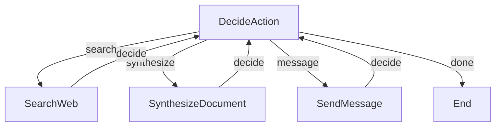

# Intelligent Secretary/Assistant Agent

An **intelligent and proactive** PocketFlow agent that understands natural language requests and autonomously decides what actions to take.

## Features

The secretary agent **intelligently analyzes your request** and can:
- **Search the web** for information
- **Synthesize documents** and summaries from gathered information
- **Send messages** to colleagues (email placeholder)
- **Chain multiple actions** to complete complex requests

## Key Innovation

🎯 **No hardcoded tasks!** Simply give it a natural language request, and the agent figures out what to do.

## Getting Started

1. Install the required dependencies:

```bash
pip install -r requirements.txt
```

2. Set your OpenAI API key as an environment variable:

```bash
export OPENAI_API_KEY=your_api_key_here
```

3. Run with the default request:

```bash
python main.py
```

4. Or give it your own request:

```bash
python main.py "Search for Immanuel Kant's biography and make me a synthesis in two paragraphs"
```

```bash
python main.py "Find who won the Nobel Prize in Physics 2024"
```

```bash
python main.py "Ask Sarah about the Q4 marketing budget status"
```

## How It Works

The agent uses an **intelligent decision loop** pattern inspired by research agents:



### Agent Flow

1. **DecideAction**: Analyzes your request and current context, decides the next action
2. **Action Nodes**: Execute the chosen action (search/synthesize/message)
3. **Loop Back**: Return to DecideAction with updated context
4. **Repeat**: Until the agent decides the task is complete

### Example: Multi-Step Request

Request: *"Search for Immanuel Kant's biography and make me a synthesis in two paragraphs"*

**Agent's thought process:**
1. **DecideAction**: "I need information about Kant first" → **search**
2. **SearchWeb**: Searches "Immanuel Kant biography"
3. **DecideAction**: "Now I have info, I should create the synthesis" → **synthesize**
4. **SynthesizeDocument**: Creates 2-paragraph summary
5. **DecideAction**: "Task complete!" → **done**

## Files

- [`main.py`](./main.py): Entry point - accepts natural language requests
- [`flow.py`](./flow.py): Intelligent decision loop flow
- [`nodes.py`](./nodes.py): Four node types (DecideAction, SearchWeb, SynthesizeDocument, SendMessage)
- [`utils.py`](./utils.py): Utility functions (LLM, web search, messaging)
- [`requirements.txt`](./requirements.txt): Required dependencies

## Example Output

```
============================================================
🤖 INTELLIGENT SECRETARY ASSISTANT
============================================================

📝 Your request:
Search for Immanuel Kant's biography and make me a synthesis in two paragraphs
============================================================

🤔 Analyzing what to do next...
🔍 Decision: Search for 'Immanuel Kant biography'
🌐 Searching the web...
QUERY: Immanuel Kant biography
✓ Search completed, results added to context

🤔 Analyzing what to do next...
📝 Decision: Synthesize - create a 2-paragraph biography synthesis
✍️ Creating synthesis...
✓ Synthesis completed

🤔 Analyzing what to do next...
✅ Decision: Task is complete!

============================================================
📊 FINAL RESULT
============================================================

Immanuel Kant (1724-1804) was a German philosopher who is widely
considered one of the most influential thinkers in Western philosophy.
Born in Königsberg, Prussia, Kant spent his entire life in his hometown,
where he developed revolutionary ideas about metaphysics, epistemology,
and ethics. His most famous work, "Critique of Pure Reason" (1781),
attempted to reconcile rationalism and empiricism by arguing that while
all knowledge begins with experience, it doesn't necessarily arise from
experience alone.

Kant's philosophical contributions fundamentally shaped modern thought,
particularly through his concept of the "categorical imperative" in
ethics and his theory that human understanding imposes structure on our
perception of reality. His influence extends beyond philosophy into
fields such as law, politics, and aesthetics. Despite never traveling
more than 10 miles from his birthplace, Kant's ideas about human reason,
morality, and the limits of knowledge continue to resonate globally.

============================================================
```

## Architecture

### Four Node Types

**1. DecideAction** - The "brain" of the agent
- Analyzes the user request and current context
- Uses LLM to decide the next action (search/synthesize/message/done)
- Returns structured YAML with the decision

**2. SearchWeb** - Web search capability
- Performs DuckDuckGo search
- Adds results to context
- Loops back to DecideAction

**3. SynthesizeDocument** - Document creation
- Creates summaries, memos, or documents
- Uses all gathered context
- Loops back to DecideAction

**4. SendMessage** - Communication
- Drafts professional messages
- Sends to colleagues (placeholder)
- Loops back to DecideAction

### Shared Store Schema

```python
shared = {
    "user_request": str,      # The original natural language request
    "context": str,           # Accumulated context from all actions
    "final_result": str,      # The final output (if any)

    # Temporary action parameters (set by DecideAction)
    "search_query": str,      # For SearchWeb node
    "synthesize_instruction": str,  # For SynthesizeDocument node
    "message_target": str,    # For SendMessage node
    "message_question": str   # For SendMessage node
}
```

### Decision-Making Process

The `DecideAction` node uses a carefully crafted prompt that:
1. Shows the user's original request
2. Shows what has been accomplished so far (context)
3. Lists available actions with parameters
4. Asks the LLM to choose the next action
5. Parses the YAML response

This allows the agent to autonomously:
- Break down complex requests into steps
- Chain multiple actions together
- Know when the task is complete

## Extending the Agent

You can easily add new action types by:

1. **Create a new node class** (e.g., `ScheduleMeeting`)
2. **Add the action to DecideAction's prompt**
3. **Wire it in flow.py**

Example - adding a "calculate" action:

```python
# In nodes.py
class Calculate(Node):
    def prep(self, shared):
        return shared["calculation_expression"]

    def exec(self, expression):
        # Perform calculation
        result = eval(expression)  # Use safely in production!
        return result

    def post(self, shared, prep_res, exec_res):
        shared["context"] += f"\n\n[CALCULATION]\n{prep_res} = {exec_res}"
        return "decide"

# In flow.py
calculate = Calculate()
decide - "calculate" >> calculate
calculate - "decide" >> decide

# In DecideAction's prompt, add:
# [5] calculate
#   Description: Perform mathematical calculations
#   Parameters:
#     - expression (str): Mathematical expression to evaluate
```

## Design Pattern

This example demonstrates the **Agent Pattern** from the PocketFlow guide:
- ✅ Dynamic decision-making based on context
- ✅ Intelligent action selection using LLM
- ✅ Context accumulation across actions
- ✅ Self-correcting loop until task completion
- ✅ Natural language interface

This is much more powerful than hardcoded task queues!
